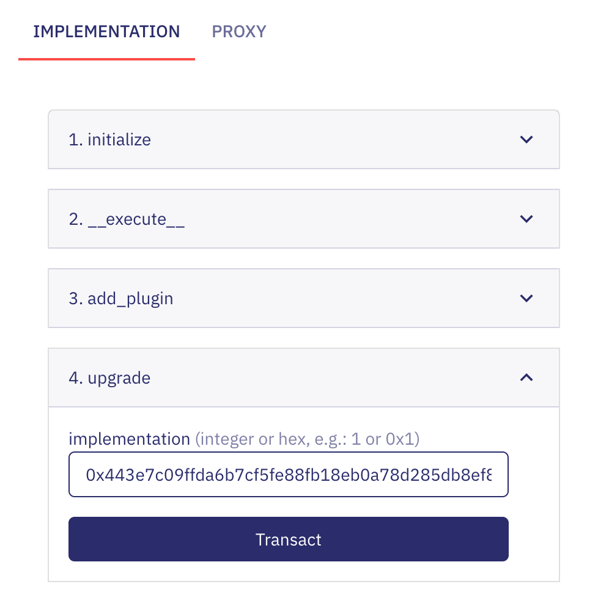
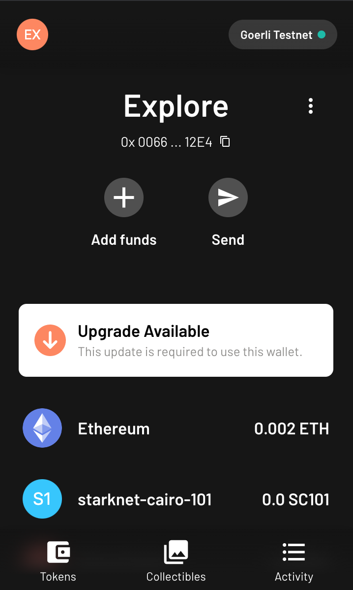
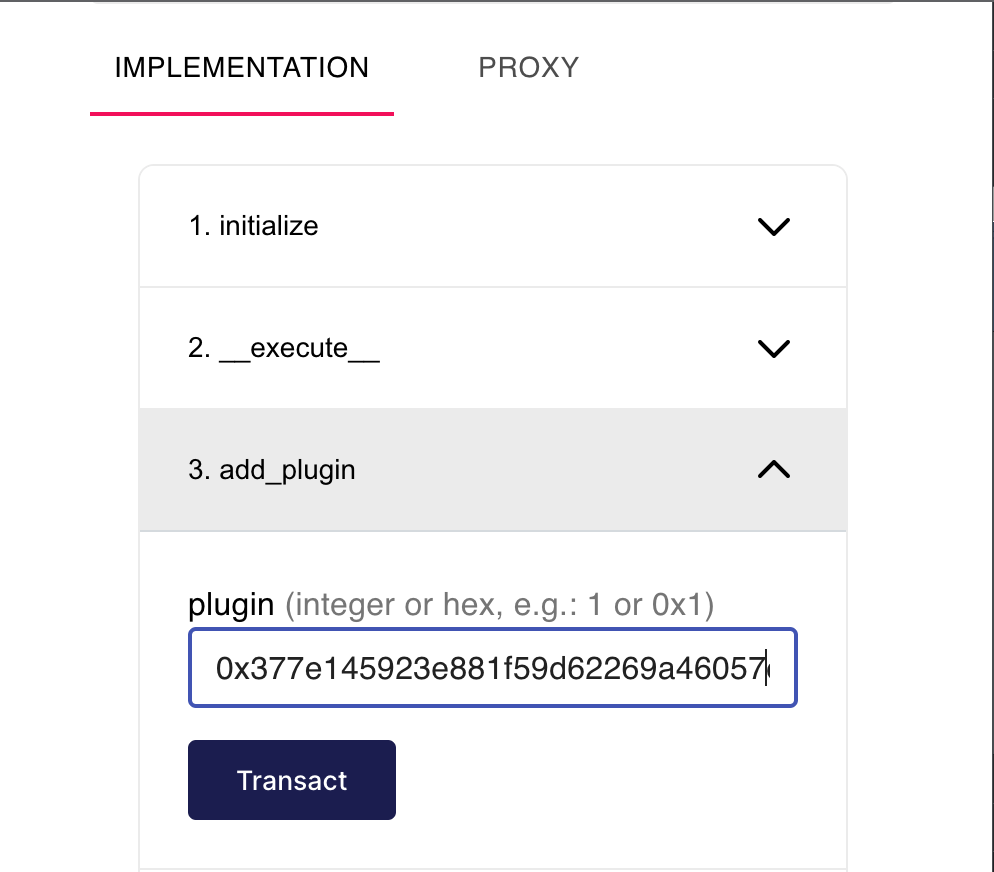
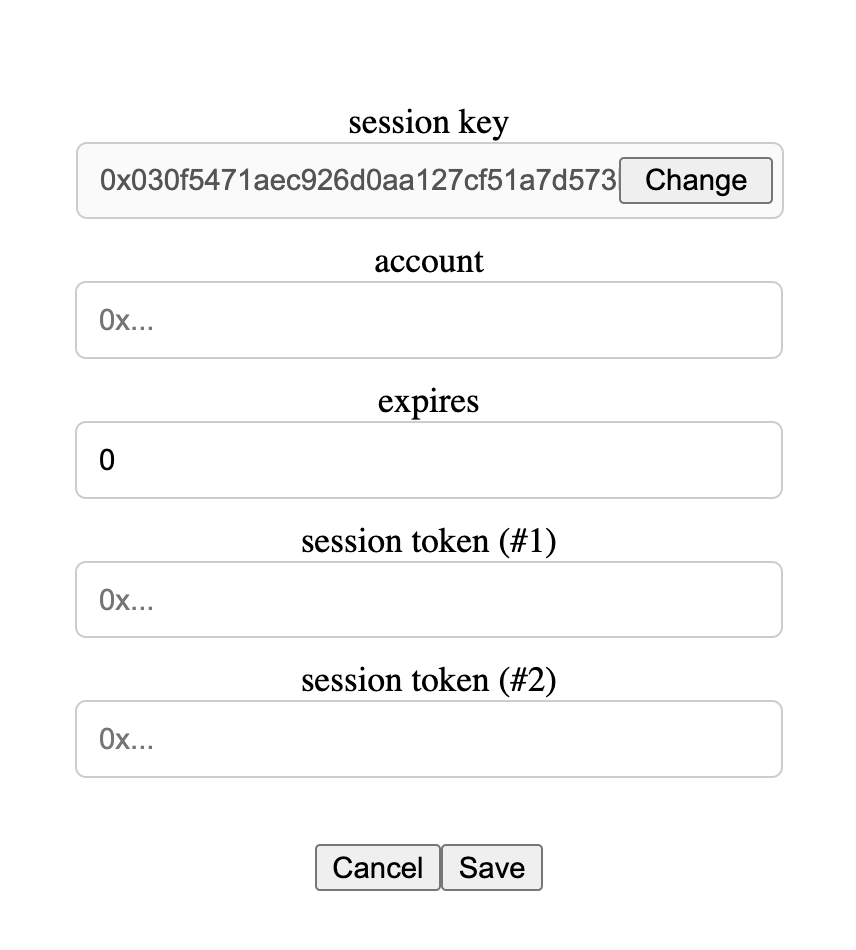
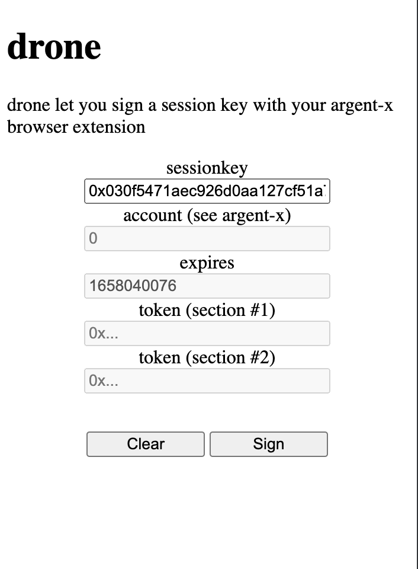
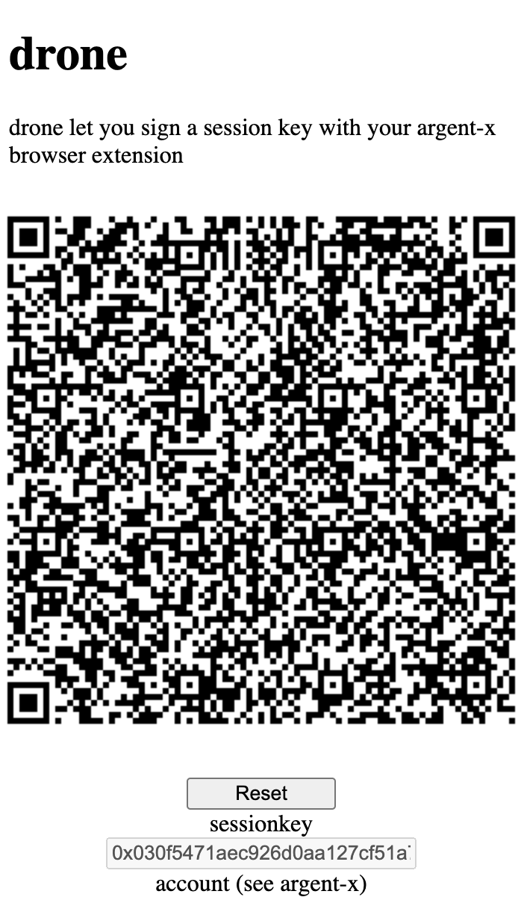
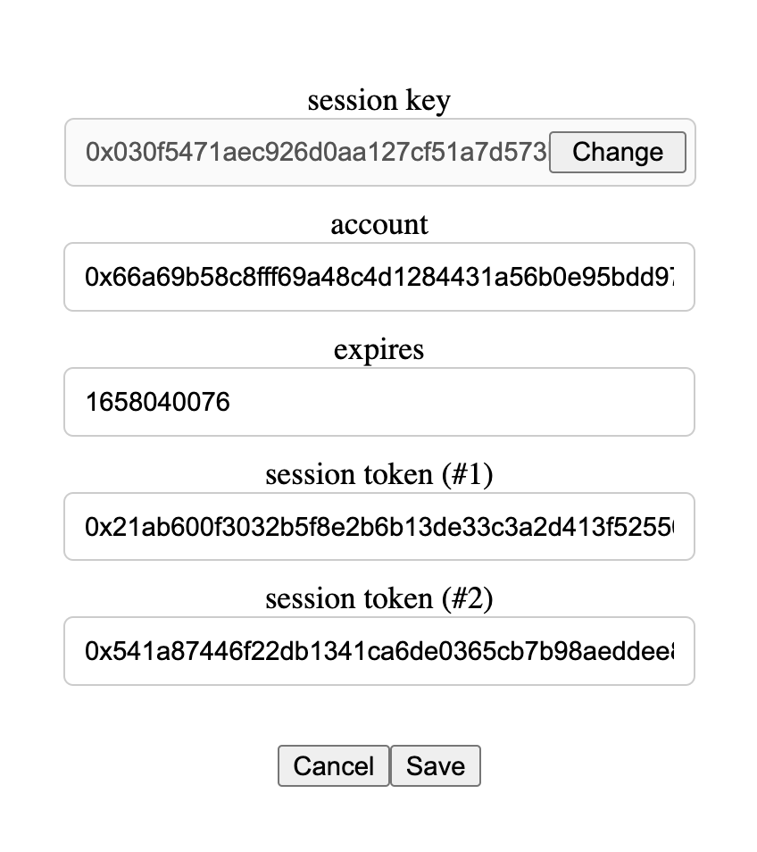

The Starknet Burner is a Javascript Wallet that works on a browser, including
on your mobile phone. It relies on an upgraded argent-x account that supports
plugins. To use it, you should:

1. make sure your account is changed with ETH.
2. upgrade the argent-x account to an argent-x account that supports plugins
3. withdraw some Starkpills from the Faucet.
4. add the plugin that checks a specific signature to your account
5. connect to the burner wallet and generate a session key
6. send the session key to the drone application that will help you to sign
   it and send a session token back to the application
7. register the session token with the burner wallet
8. play with the wallet
   
> Before you start, the current plugin is not secure and granting access to
> the burner wallet will enable the user to use your account for any purpose.
> For now, it is only available on the testnet (goerli) and you should use it
> on a separate account.

### Make sure your account is charged

Before you proceed further, make sure your account is charged with ETH and
Stark Pills as it might be useful.

### Upgrading your contract

The upgraded contract is `contracts/ArgentAccount.cairo` available from the
[bugfix/session-key](https://github.com/gregoryguillou/argent-contracts-starknet/tree/bugfix/session-key)
branch of a fork of the argent-x contract. A compiled version of it is
available in the `plugin/contracts` folder as `argentaccount_plugin.json`. The
class hash of the contract is `0x443e7c09ffda6b7cf5fe88fb18eb0a78d285db8ef8277c3918326d476c73efa`.

To upgrade your account, copy the account address from the argent-x extension,
navigate to [voyager](https://goerli.voyager.network) and check your contract.
Go to the `Write Contract` method and run the `upgrade` function with new
contract address like below:

<p align="center">

</p>

To check the implementation has changed, you should wait for the contract to be upgraded
and check the contract in voyager. You should see in the `Write Contract` methods, there
is a `add_plugin` function. Another way is to open the Argent-x extension, you should
now see that the extension detects it is not its original contract and requests you to
upgrade it back (**do not** use the `Upgrade` function).

<p align="center">

</p>

You might also use the `proxy_abi.json` file in `plugin/contracts` and check
the implementation has changed from the starknet CLI.

```shell
export MYACCOUNT=0x...
starknet call \
   --address $MYACCOUNT \
   --function get_implementation \
   --abi proxy_abi.json
```

### Withdrawing Starkpills

The Faucet checks:
- the account you are using should not have more than 1 STRK already
- the account implementation should be the modified starknet account
  that supports plugins

Assuming all the condition above are met, you would get 5 Starkpills
by requesting the Faucet on Voyager at
[0x05a8..aadf](https://goerli.voyager.online/contract/0x05a87f6bec0b6121e55f291f8e06e6149accd706fb43c725a7f1fd3f3f62aadf).

> The Starkpill Faucet supply is limited. If it gets empty,
> contact-us.

### Add the plugin that checks a specific signature

Plugins are relying on a specific signature that depends from the website and
uses a specific scheme inpired from EIP-712 that `starknet.js` and `argent-x`
implement. As a result, the plugin embeds some properties that should help
people to check the website it is supposed to use. We have developed a plugin
that uses the `starknet.burner` domain. To check the code, see the
[`SessionKey.cairo`](../plugin/src/SessionKey.cairo) file in `plugin/src`
folder. We have deployed the plugin on the testnet (goerli) and the plugin
class hash is
`0x377e145923e881f59d62269a46057d8dac67e27d68a12679b198d4224a0966b`. 

To add the plugin to your account, copy the account address from the argent-x
extension, navigate to [voyager](https://goerli.voyager.network) and check your
contract. Go to the `Write Contract` method and run the `add_plugin` function
with the plugin hash like below:

<p align="center">

</p>

To check the implementation has changed, you should wait for the plugin to be added
and check the contract in voyager. You should see in the `Read Contract` methods, there
is a `is_plugin` function. You can use it with the Plugin Hash.

You might also use the `argentaccount_plugin_abi.json` file in `plugin/contracts` and
check the implementation has changed from the starknet CLI.

```shell
export MYACCOUNT=0x...
starknet call \
   --address $MYACCOUNT \
   --function is_plugin \
   --abi argentaccount_plugin_abi.json \
   --inputs 0x377e145923e881f59d62269a46057d8dac67e27d68a12679b198d4224a0966b
```

### First Burner Wallet connection

To start the burner wallet, run:

```shell
cd burner
npm install
npm run dev
```

When you connect to the burner wallet, for the first time, you get a string
asking for the account and session tokens like below:

<p align="center">

</p>

You can copy the session key; we will use it with the drone application to
grant access to the burner wallet.

### Connect to the drone application

To start drone, run:

```shell
cd drone
npm install
npm run dev
```

When you connect to drone, it requests for a session key like below:

<p align="center">

</p>

You can copy the session key and click on the sign button. It will connect to
your argent-x extension and request to sign the session key. Once you have
signed the session key, it will provide the session token to the burner wallet.

<p align="center">

</p>

### Register the session token with the burner wallet

You can copy the URL from drone, and use it from your browser and it should
reload the burner wallet this time with the session token and the associated
account. Check it is correctly loaded by clicking on the `Keys...` button, the
keys screen should look like below:

<p align="center">

</p>

### You are ready to use the burner wallet

You can click on the `Send...` button and send Starkpill tokens to whoever you
want from the burner wallet...

### To continue...

If you like it, add a star to the project on
[GitHub](https://github.com/dontpanicdao/starknet-burner). If you need more
features or have questions, open an issue or contact us on the Starknet
Discord.
